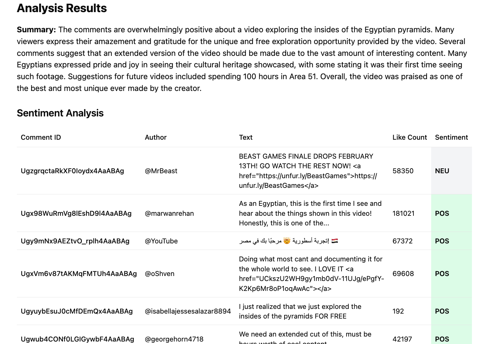

# ytc-analyzer

*analysis of https://www.youtube.com/watch?v=NDsO1LT_0lw*

analyzes and summarizes comments from YouTube videos using sentiment analysis and large language models. 

### tech stack
- **Backend:** Python (using `azure-functions` library with FastAPI style annotations)
- **Frontend:** React with Vite, Tailwindcss, and shadcn components
- **Natural Language Processing:** `nltk` library for sentiment analysis, `langchain` using OpenAI 4o model for summarization, and `googletrans` for translating non-english comments during data-cleaning
- **Cloud:** Azure Functions hosting the Python functions as a serverless backend, and Azure Static Web Apps for hosing the React webapp
- **CI/CD:** GitHub Actions
